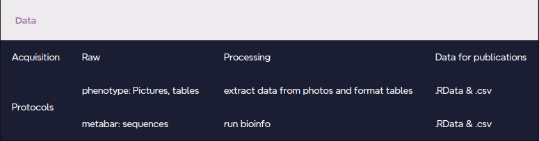

# Data framework

INHERSEED aims to respect the FAIR principles for open science. 
To do so we share in the present document protocols, raw data, processing scripts/procedures and, processed data as used in resulting articles \@ref(fig:dframework).

```{r dframework, echo=FALSE, out.width="50%", fig.cap="Shared info regarding acquisition, raw data, processing and published data in the INHERSEED project"}

```

To ensure reproducibility data standard processing (bioinformatic pipeline and diagnostics) were embbeded in snakemake pipeline.
R session info were also stored as text files available [here](). 
The Data Management Plan is hosted [here]().

Deliverable of the project are:

* Data, protocols and workflows:

  + github hosted document. (Text)
  + Metabarcoding dataset: amplicon sequencing dataset as .fastq for *gyrB* and *ITS1* markers. (Dataset)
  + Seed and plant phenotype as .csv. (Dataset)
  + Processing scripts and pipelines (Python, Bash and R). (Workflow)
  + Protocols for all data acquisition (Text)

* Results:

**WP1**:
  + Plant taxonomy and traits influence on seed microbiota
  + Assessment of microbial transmission from plants to seeds
  + Exploring phylosymbiosis on seed microbiota
  
**WP2**:
  + Evaluation of microbial transmission from seeds to seedlings
  + Inherited and non-inherited taxa transmission success
  + Exploring phylosymbiosis on seedling microbiota
  + Identification of microbial taxa with potential effects on seedling phenotypes

**WP3**:
  + Experimental validation of vertical transmission of inherited taxa
  + Identification of inherited taxa affecting plant fitness
  + Identification of inherited taxa influencing microbiota assembly
  
  
#links to data info

* [Project proposal](document/full_proposal/aapg_20203-INHERSEED_full_proposal.pdf)
* [Original seeds sources]
  + [species list]
  + [suppliers]
* [Seed phenotype]
  + [Seed pictures]
  + [TRAITOR software]
* [DNA extractions]
  + [Seeds]
  + [Leaves]
  + [Roots]
  + [Soil]
* [Plant phenotype]
